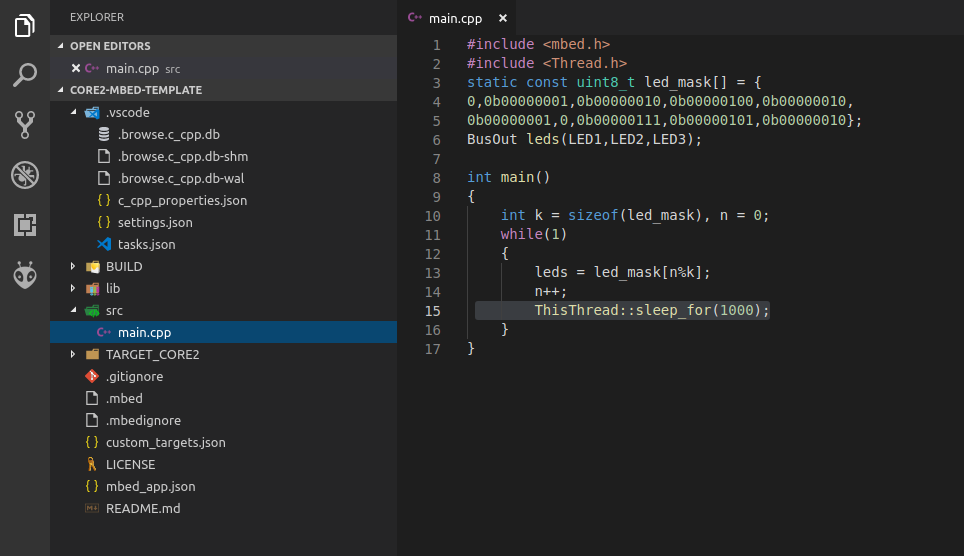

# Using CORE2 with Mbed OS

## Introduction

<div>
<center></center>
</div>

**Mbed OS** is free, open-source platform and embedded operating system designed for IoT devices based on Arm Cortex-M family of microcontrollers. It is developed as collaborative project by *Arm*, its partners and growing community of individual devs from across the world. Mbed OS is distributed under the [Apache-2.0 License](https://en.wikipedia.org/wiki/Apache_License) and it's available on project's GitHub page : https://github.com/ARMmbed/mbed-os.

Besides support for variety of boards from different manufacturers the framework has features like:
* built-in support for connectivity options like *Bluetooth LE*, *Wi-Fi*, *Ethernet*, *Cellular*, *LoRa LPWAN*, *NFC* and others,
* RTOS core based on open-source *CMSIS-RTOS RTX* (it is also possible to build projects without it),
* *Hardware Enforced Security* and *Communications Security*,
* easy and portable API.

You can learn more about Mbed OS on its [official webpage](https://www.mbed.com/en/platform/mbed-os/).

Useful links:
* [Mbed OS documentation](https://os.mbed.com/docs/v5.10/)
* [Mbed OS Doxygen API](https://os.mbed.com/docs/v5.10/mbed-os-api-doxy/modules.html)

## First Steps

In this tutorial we will show you how to build, compile and run mbed applications on CORE2 using mbed offline tools. You will be introduced to basics of mbed API, learn how to use rosserial library to connect your mbed application with SBC and more. Let's hack!

### Prerequisites

#### Hardware

* CORE2-ROS (with SBC) or CORE2 and computer running Linux with ROS Kinetic,   
* *ST-LINK V2 programmer* to flash CORE2 with mbed firmware,

#### Software

Before we start make sure you have following tools installed on your system:

* [Visual Studio Code IDE](https://code.visualstudio.com/)
* [GNU Arm Embedded version 6 toolchain](https://developer.arm.com/open-source/gnu-toolchain/gnu-rm/downloads)
* [STM32 ST-LINK Utility](https://www.st.com/en/development-tools/stsw-link004.html) (Windows only)
* [stlink flasher](https://github.com/texane/stlink/blob/master/README.md) (Mac or Linux)

You can check our tutorial: [2. Offline development tools](https://husarion.com/core2/tutorials/other-tutorials/offline-development-tools) to find information on stlink flasher and VS Code IDE installation and configuration. 

Everything up and ready? Proceed to the next step then.

### mbed-cli installation

`mbed-cli` is a package name of **Arm Mbed CLI**, a command-line tool that enables use of Mbed build system, GIT/Mercurial-based version control, dependencies management and so on. Check [Mbed CLI GitHub page](https://github.com/ARMmbed/mbed-cli) or [Mbed documentation](https://os.mbed.com/docs/v5.10/tools/developing-mbed-cli.html) to learn more about the tool.  

Official documentation provides tutorial on mbed-cli installation. You can access it [here](https://os.mbed.com/docs/v5.10/tools/installation-and-setup.html).
Installers for both Windows and macOS are provided. Linux users have to install tool manually.  

To check if installation was successful open terminal and run:

```bash
    $ mbed --version
    1.8.3
```

After installation you have to inform Mbed CLI about location of compiler (in our case GCC Arm Embedded Compiler) binaries. We will use global setting. Run:

```bash
    $ mbed config -G GCC_ARM_PATH <path to compiler>
```

Linux example:

```bash
    $ mbed config -G GCC_ARM_PATH /home/szysza/opt/gcc-arm-none-eabi-6-2017-q2-update/bin
```

Windows example:

```bash
    $ where arm-none-eabi-gcc # prints path to arm-none-eabi-gcc.exe if in PATH
    $ mbed config -G GCC_ARM_PATH "C:\Program Files (x86)\GNU Tools ARM Embedded\6 2017-q2-update\bin"
```

You can check current configuration by running:

```bash
    $ mbed config --list
```

### Preparing a workspace

Create a new folder `core2-mbed-workspace`. It will serve as workspace for your mbed projects. Run:

```bash
    $ mkdir core2-mbed-workspace && cd core2-mbed-workspace
```
Next step is to import `mbed-os` library. It will be used by all your projects. In your workspace folder run:

```bash
    $ mbed import mbed-os
    [mbed] Working path "E:\mbed_projects\core2-mbed-workspace" (directory)
    [mbed] Program path "E:\mbed_projects\core2-mbed-workspace"
    [mbed] Importing program "mbed-os" from "https://github.com/ARMmbed/mbed-os" at latest revision in the current branch
```

Mbed CLI needs to know the path to `mbed-os` directory. This way all your projects can use one instance of library (default configuration is to have separate instance of library for each project). Run:

```bash
    $ mbed config -G MBED_OS_DIR <path to mbed-os>
```

Example:

```bash
    $ mbed config -G MBED_OS_DIR "E:\mbed_projects\core2-mbed-workspace\mbed-os"
    [mbed] Working path "E:\mbed_projects\core2-mbed-workspace" (directory)
    [mbed] Program path "E:\mbed_projects\core2-mbed-workspace"
    [mbed] E:\mbed_projects\core2-mbed-workspace\mbed-os now set as global MBED_OS_DIR
```

#### Adding .mbedignore

In order to add support for CORE2 target and speed-up building of your projects we will exclude certain folders of `mbed-os` library from compilation. For this purpose Mbed build system provides `.mbedignore` files. They have similar structure to `.gitignore` files used by GIT.

In your local `mbed-os` library directory create a new file and name it `.mbedignore`. Open it and add following lines:

```
features/cellular/*
features/cryptocell/*
features/deprecated_warnings/*
features/device_key/*
features/lorawan/*
features/lwipstack/*
features/nanostack/*
features/netsocket/*
features/nfc/*
features/unsupported/*
components/wifi/*
components/802.15.4_RF/*
components/storage/*
targets/TARGET_STM/TARGET_STM32F4/TARGET_STM32F407xG/device/TOOLCHAIN_GCC_ARM/STM32F407XG.ld
targets/TARGET_STM/TARGET_STM32F4/TARGET_STM32F407xG/device/TOOLCHAIN_GCC_ARM/startup_stm32f407xx.S
```

Only two last entries are necessary. You can learn more about ignoring files [here](https://os.mbed.com/docs/v5.10/tools/ignoring-files-from-mbed-build.html).

### Template Project

We will start by setting up a template project. You can use it as starting point for other, more advanced ones. 

Just download the zip : https://github.com/byq77/core2-mbed-template/archive/master.zip and extract it in your workspace.

On Linux:

```bash
    $ wget https://github.com/byq77/core2-mbed-template/archive/master.zip && unzip master.zip
```

You can also clone the repo using GIT:

```bash
    $ git clone https://github.com/byq77/core2-mbed-template.git
```

Open `core2-mbed-template-master` directory in Visual Studio Code. In file `setting.json` from directory `.vscode` change the value of `C_cpp.default.compilerPath` to match location of `arm-none-eabi-gcc` on your system:

<div>
<center></center>
</div> 

It will enable more accurate IntelliSense feature in editor.

#### Template files

Open the template directory and select `src/main.cpp`. You should see:

<div>
<center></center>
</div> 

As you no doubt have guessed this simple code just lights up three on-board leds in some sequence. We instantiate `BusOut` object that allows to control multiple digital pins at the same time. It's used to blink leds in order described by `leds_mask` array at the interval introduced by function `ThisThread::sleep_for(1000)`.    

Let's explore other important files of template project. Open file `custom_target.json`:

<div>
<center></center>
</div> 

Mbed OS Configuration system use this file to define user's custom targets. Since CORE2 is not officially supported by Mbed OS `custom_target.json` and files from `TARGET_CORE2` are used to describe our board. You can learn more about configuration system [here](https://os.mbed.com/docs/v5.10/reference/configuration.html).

In folder `TARGET_CORE2` you can find files `PinNames.h` and `PeripheralPins.c`. First one defines pin names of mcu and the latter defines peripherals that can be used on each pin.

Another file that is used by Mbed OS configuration system is `mbed_app.json`. Open it.

<div>
<center></center>
</div> 

In this file you can override default settings for application, define new configuration entries and create custom macros. In presented configuration :
* line `10` enables spawning a new thread for shared event queue, 
* lines `11` and `12` set default baudrate to 115200,
* line `13` shifts the start of firmware in flash so it doesn't override bootloader.   

You can learn details of each settings from documentation.

The last important file you should be aware of is `task.json` from `.vscode` directory. It defines tasks that are recognized by Visual Studio Code IDE. They can be accessed by pressing `CTRL + SHIFT + P` and typing `Task: Run Task` in Command Pallete.

<div>
<center></center>
</div> 

Both Mbed OS and VS Code configuration use simple JSON syntax. 

#### Building and flashing firmware

Press `CTRL + SHIFT + B`. It will run `CLEAN BUILD (RELEASE)` task. Wait until compilation finishes.

<div>
<center></center>
</div> 

Connect your ST-LINK programmer to debug pins of CORE2 and make sure it's connected to your computer. Press `CTRL + SHIFT + P` and in Command Pallete type `Task: Run Task`. Select `FLASH FIRMWARE (RELEASE)`. You should get:

<div>
<center></center>
</div> 

Leds on your board should start blinking accordingly. Congratulations! You've just build and flashed your first Mbed application for CORE2!

<div>
<center></center>
</div> 

> **Tasks**
> - Modify the program so as the on-board leds blink in Gray code. 
> - Add [Serial](https://os.mbed.com/docs/v5.10/apis/serial.html) to print current sequence to the stdout (micro-usb port on CORE2) at the same time. 
> - Change baudrate to 38400 in configuration files. 
> - Check target's files and learn which UART instance is connected to pins `USBTX` and `USBRX`.    

## Rosserial library

If you made it this far you must be really into this stuff! Let's do something more interesting.  

## Summary

After completing this tutorial you should know the basics of Mbed OS 
components and tools. You should be able to create, compile and run mbed 
applications on CORE2 and you should have the basic idea how to establish ROS communication
between mbed program and SBC using Rosserial library.

---------

*by Szymon Szantula, Husarion*

*Do you need any support with completing this tutorial or have any difficulties with software or hardware? Feel free to describe your thoughts on our community forum: https://community.husarion.com/ or to contact with our support: support@husarion.com*